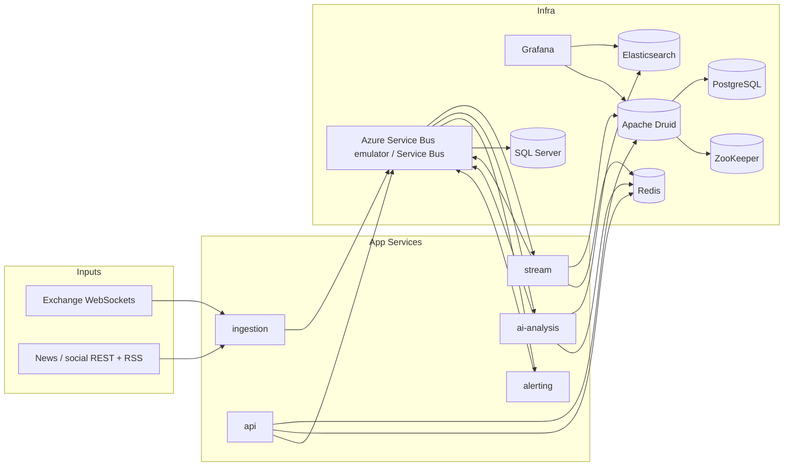

# Architecture

This platform is a portfolio project only. No financial advice. No real trades.

## Overview

The repo implements a five-service, event-driven market intelligence stack. Market and news inputs are normalized into a shared schema, moved through Azure Service Bus, enriched by stream processing and RAG-based analysis, then exposed through REST, WebSocket, and observability surfaces.

## Services

| Service | Responsibility | Main inputs | Main outputs |
|---|---|---|---|
| `ingestion` | Normalize market and news payloads into `MarketEvent` and `NewsEvent` | Exchange WebSockets, RSS, REST/social feeds, deterministic replay | `market.raw`, `news.raw` |
| `stream` | Compute SMA, EMA, RSI, volatility, trend, and anomaly flags | `market.raw` | Druid ticks/indicators, Redis snapshots, `signals` |
| `ai-analysis` | Build grounded insights with RAG and LLM guardrails | `news.raw`, `signals` | Elasticsearch indexed context, Redis insight cache, `insights` |
| `alerting` | Evaluate deterministic alert rules | `signals`, `insights` | `alerts` |
| `api` | Serve REST reads and live symbol-scoped WebSocket fanout | Druid, Redis, Service Bus subscriptions | REST responses, `WS /ws/stream` |

## Data Flow

1. `ingestion` converts upstream payloads into the shared event schema from `libs/common` and publishes to `market.raw` and `news.raw`.
2. `stream` consumes `market.raw`, keeps per-symbol history in memory, writes `ticks` and `indicators` rows to Druid, stores the latest snapshot in Redis, and publishes `signals`.
3. `ai-analysis` consumes `news.raw` and `signals`, indexes source context into Elasticsearch, retrieves grounding context through the RAG pipeline, generates guarded summaries, caches insight payloads, and publishes `insights`.
4. `alerting` consumes `signals` and `insights`, applies deterministic thresholds, and publishes `alerts`.
5. `api` reads Druid and Redis for REST queries, peeks Service Bus for recent `signals`, `alerts`, and `insights`, and fans out live topic messages to WebSocket clients by symbol.

## Infrastructure

The local compose stack mirrors the production-shaped dependency graph:

- Azure Service Bus emulator plus SQL Server backing store
- PostgreSQL 16 for app metadata and the Druid metadata store
- ZooKeeper for Druid coordination
- Apache Druid 30 in micro-quickstart mode for local development
- Redis 7 for snapshots, caches, and idempotency markers
- Elasticsearch 8 for structured logs and kNN retrieval
- Grafana 11 for dashboards over Elasticsearch and Druid

## Observability

- Structured JSON logs from every service
- Correlation and trace IDs on HTTP and event paths
- `GET /health` and `GET /metrics` on each service
- Optional New Relic bootstrap when credentials are present
- Grafana dashboards provisioned from `infra/grafana/provisioning`

## Local Compose

The root `docker-compose.yml` starts all infra and app containers with these published ports:

- `8001` ingestion
- `8002` stream
- `8003` ai-analysis
- `8004` alerting
- `8000` api
- `5672` and `5300` Service Bus emulator
- `5432` PostgreSQL
- `2181` ZooKeeper
- `8888` Druid router
- `6379` Redis
- `9200` Elasticsearch
- `3000` Grafana
- `1433` SQL Server for the emulator

The default runtime is offline-safe. When live credentials are absent, the shared factories in `libs/common` resolve to in-memory fakes.
