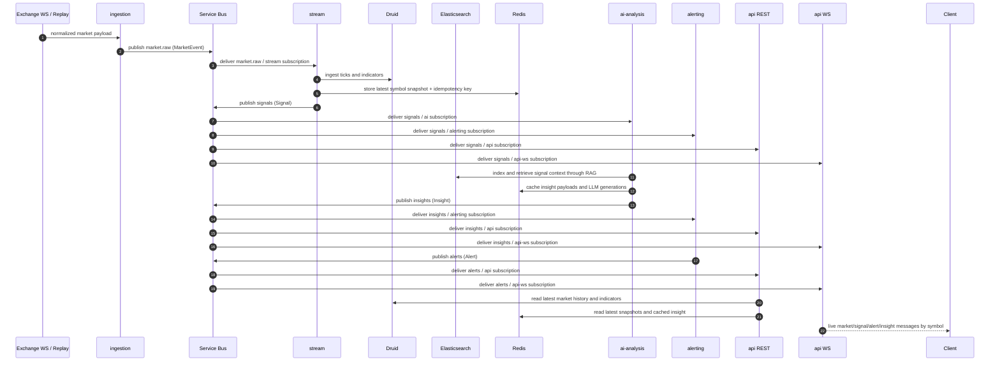
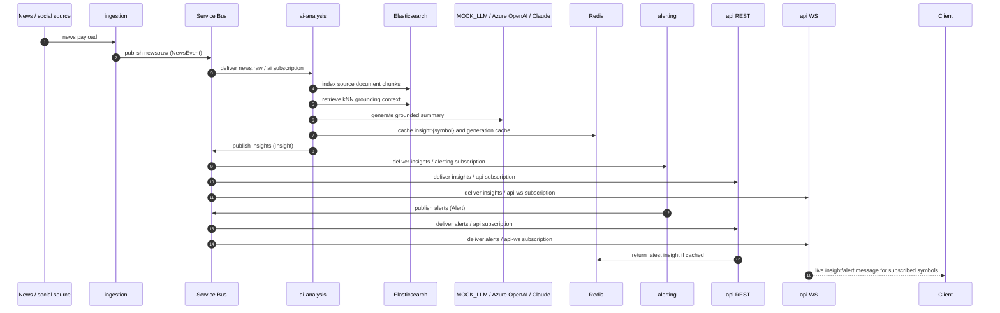

# Sequence

This platform is a portfolio project only. No financial advice. No real trades.

## Market Event Path

```mermaid
sequenceDiagram
  autonumber
  participant X as Exchange WS / Replay
  participant I as ingestion
  participant SB as Service Bus
  participant S as stream
  participant D as Druid
  participant E as Elasticsearch
  participant R as Redis
  participant A as ai-analysis
  participant L as alerting
  participant P as api REST
  participant W as api WS

  X->>I: normalized market payload
  I->>SB: publish market.raw (MarketEvent)
  SB->>S: deliver market.raw / stream subscription
  S->>D: ingest ticks and indicators
  S->>R: store latest symbol snapshot + idempotency key
  S->>SB: publish signals (Signal)
  SB->>A: deliver signals / ai subscription
  SB->>L: deliver signals / alerting subscription
  SB->>P: deliver signals / api subscription
  SB->>W: deliver signals / api-ws subscription
  A->>E: index and retrieve signal context through RAG
  A->>R: cache insight payloads and LLM generations
  A->>SB: publish insights (Insight)
  SB->>L: deliver insights / alerting subscription
  SB->>P: deliver insights / api subscription
  SB->>W: deliver insights / api-ws subscription
  L->>SB: publish alerts (Alert)
  SB->>P: deliver alerts / api subscription
  SB->>W: deliver alerts / api-ws subscription
  P->>D: read latest market history and indicators
  P->>R: read latest snapshots and cached insight
  W-->>Client: live market/signal/alert/insight messages by symbol
```

## News to Insight Path

```mermaid
sequenceDiagram
  autonumber
  participant N as News / social source
  participant I as ingestion
  participant SB as Service Bus
  participant A as ai-analysis
  participant E as Elasticsearch
  participant LLM as MOCK_LLM / Azure OpenAI / Claude
  participant R as Redis
  participant L as alerting
  participant P as api REST
  participant W as api WS

  N->>I: news payload
  I->>SB: publish news.raw (NewsEvent)
  SB->>A: deliver news.raw / ai subscription
  A->>E: index source document chunks
  A->>E: retrieve kNN grounding context
  A->>LLM: generate grounded summary
  A->>R: cache insight:{symbol} and generation cache
  A->>SB: publish insights (Insight)
  SB->>L: deliver insights / alerting subscription
  SB->>P: deliver insights / api subscription
  SB->>W: deliver insights / api-ws subscription
  L->>SB: publish alerts (Alert)
  SB->>P: deliver alerts / api subscription
  SB->>W: deliver alerts / api-ws subscription
  P->>R: return latest insight if cached
  W-->>Client: live insight/alert message for subscribed symbols
```
